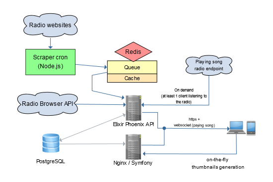

ProgRadio
=========

https://www.programmes-radio.com

Dependencies
--------------
- PHP 8.0.x / Symfony 5.2
- VueJs 3.1+
- NodeJS v10.x (Scraper) / v12.x (front)
- Elixir 1.12.x (Api / Importer)
- PostgreSQL 13 & Redis
- Nginx or Apache
- ImageMagick
- CapRover & Docker (deployment)

Run
--------------
**Scraper**: cd Scraper && node index.js

**Api / Importer**: cd progradio_api && iex -S mix phx.server (dev)

**Vue app**: npm run build / npm run dev

Architecture
--------------

