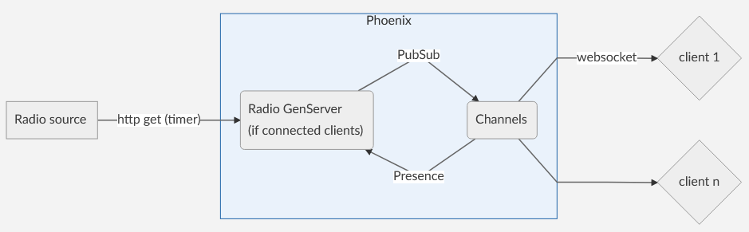

# ProgRadio LiveSong

[Programmes-Radio](https://www.programmes-radio.com/en/) is a website displaying French radios schedules and a stream player. This article will explore how we wrote the "currently playing song" feature for the player.

Thanks to Elixir and the Beam this needed really little code. For this feature we'll leverage the following libraries:

- Phoenix Channels, Presence & PubSub
- Registry, GenServer & Dynamic Supervisor

**Demo:** [https://livesongdemo.funkybits.fr](https://livesongdemo.funkybits.fr)

**Repo:** [https://github.com/conradfr/LiveSongDemo](https://github.com/conradfr/LiveSongDemo)

# Specs

The goal was the following: when one or more user is listening to a radio we get the current playing song from an external source at an interval and broadcast it to the users, and stop when nobody is listening to that radio anymore.

The architecture will be as follow:



# Demo implementation

We generate a basic Phoenix project.

> mix phx.new live_song --no-ecto --no-dashboard --no-gettext --no-webpack

## Data fetching

Let's start with the data backend part.

To get the current song playing we'll request an external json endpoint (with HTTPoison) at an interval. Each radio will be represented as a GenServer that will hold the current song (for people joining the topic) and manage the refresh.

The GenServer will be generic and use another module specific to each radio, passed dynamically and implementing a behavior.

### 1. Defining the behavior.

We create the *lib/live_song/radio/radio_provider.ex* file:

```elixir
defmodule LiveSong.RadioProvider do  
  
  @doc """ 
    Get source data as map 
  """  
  @callback get_data(String.t()) :: map() | nil  
  
  @doc """  
    Get artist & song as map %{artist: nil, title: nil} 
  """  
  @callback get_song(String.t(), map() | nil) :: map()  
end
```
Just two functions, with get_song/2 using data from get_data/1

### 2. Writing a radio module implementing this behavior.

We add HTTPoison as a dependency in your mix.exs file:

```elixir
{:httpoison, "~> 1.8"}
```

We'll use the French FIP radio as an example. This radio provides and endpoint returning json.

We create the *lib/live_song/radio/fip.ex* file:

```elixir
defmodule LiveSong.RadioProvider.Fip do
  require Logger

  @behaviour LiveSong.RadioProvider

  @radio_endpoint "https://www.fip.fr/latest/api/graphql?operationName=NowList&variables={\"bannerPreset\":\"266x266\",\"stationIds\":[7]}&extensions={\"persistedQuery\":{\"version\":1,\"sha256Hash\":\"151ca055b816d28507dae07f9c036c02031ed54e18defc3d16feee2551e9a731\"}}"

  @impl true
  def get_data(name) do
    Logger.debug("Radio provider - #{name}: querying...")

    try do
      @radio_endpoint
      |> HTTPoison.get!()
      |> Map.get(:body)
      |> Jason.decode!()
      |> Map.get("data", %{})
      |> Map.get("nowList", %{})
      |> List.first()
    rescue
      _ -> nil
    end
  end

  @impl true
  def get_song(name, data) do
    case data do
      nil ->
        Logger.warn("Radio provider - #{name}: error fetching song data or empty")
        %{}

      _ ->
        Logger.debug("Radio provider - #{name}: querying OK")
        %{interpreter: data["playing_item"]["title"], title: data["playing_item"]["subtitle"]}
    end
  end
end
```

Nothing too fancy, we implement the behavior's callbacks and parse the data according to the json the radio sends us.

We can try it by typing in the REPL: `LiveSong.RadioProvider.Fip.get_data("fip") |> (&LiveSong.RadioProvider.Fip.get_song("fip", &1)).()`

Which should give us something like *%{artist: "Owlle", title: "Sounds familiar"}* or an empty map *%{}* if an error happened or the radio is not currently playing music.

### 3. Using it with our GenServer

Here we'll use the Registry feature, you can read more about it [here](https://hexdocs.pm/elixir/Registry.html).

We add it to our the supervision children in *application.ex*:

```elixir
{Registry, [keys: :unique, name: LiveSongRadioProviderRegistry]}
```

We then create the *lib/live_song/radio_server.ex* file:

```elixir
defmodule LiveSong.RadioServer do  
  use GenServer, restart: :transient  
  require Logger  

  # 10s 
  @refresh_radio_interval 10000  
  
  # ----- Client Interface -----
  
  def start_link({radio_topic, radio_name} = _arg) do  
    name = {:via, Registry, {LiveSongRadioProviderRegistry, radio_topic}}
  
    module_name =  
      radio_name  
      |> Macro.camelize()  
      |> (&("Elixir.LiveSong.RadioProvider." <> &1)).()
      |> String.to_existing_atom()  
  
    GenServer.start_link(__MODULE__, %{module: module_name, name: radio_topic, song: nil},  
      name: name  
    )  
  end
  
  # ----- Server callbacks -----  
  
  @impl true  
  def init(state) do  
  Logger.info("Radio provider - #{state.name}: starting ...")  
  
  Process.send_after(self(), :refresh, 250)
  {:ok, state}  
  end  

  @impl true  
  def handle_cast(:broadcast, state) do  
    LiveSongWeb.Endpoint.broadcast!(state.name, "playing", state.song)  
    {:noreply, state}  
  end

  @impl true  
  def handle_info(:refresh, %{module: module, name: name} = state) do  
  {_data, song} = get_data_song(module, name)  

  LiveSongWeb.Endpoint.broadcast!(state.name, "playing", song)
  Process.send_after(self(), :refresh, @refresh_radio_interval)  
  
  Logger.debug("#{inspect song}")
  Logger.info("Radio provider - #{name}: song updated (timer)")  
  
  {:noreply, %{module: module, name: name, song: song}}  
  end  
  
  # ----- Internal -----  
  
  @spec get_data_song(atom(), String.t()) :: tuple()  
  defp get_data_song(module, name) do  
    data = apply(module, :get_data, [name])  
    song = apply(module, :get_song, [name, data]) || %{}  
  
   {data, song}  
  end  
end
```

We use Registry to get a process name, to avoid starting multiple processes for the same radio. We also use the radio name to find our radio module, and access it dynamically with apply/3.

You may have notice we call LiveSongWeb.Endpoint.broadcast!/3, which sends data to a PubSub topic. For now it sends it in a void but it'll come handy later.

> Returning the data alongside the song map was not really necessary here. In the actual implementation we use it to get the song ending time (when available) and adding a custom refresh for extra accuracy.

We can test our radio server by typing in the iex session:

```elixir
LiveSong.RadioServer.start_link({"song:fip", "fip"})
```

Which should print something like:
> [info] Radio provider - song:fip: starting ...
> {:ok, #PID<0.430.0>}
> iex(2)> [debug] Radio provider - song:fip: querying...
> iex(2)> [debug] Radio provider - song:fip: querying OK
> iex(2)> [debug] %{artist: "Alpha Blondy", title: "Les chiens"}
> iex(2)> [info] Radio provider - > song:fip: song updated (timer)

## Enabling channels

We can now go into the network part by leveraging Channels. Check the docs [here](https://hexdocs.pm/phoenix/channels.html#content).

In user_socket.ex we add:

```elixir
channel "radio:*", LiveSongWeb.RadioChannel
```

Then in the same folder we create *the radio_channel.ex* file:

```elixir
defmodule LiveSongWeb.RadioChannel do  
  use Phoenix.Channel  
  
  def join("radio:" <> _radio_name, _params, socket) do  
  {:ok, socket}  
  end  
end
```

When a client connects to the websocket he's automatically subscribed to a PubSub topic that match the one we broadcasted to in *song_server.ex*, all thanks to channels.

> For demo purposes we'll assume the radio module exists in our system without verification.

## Tying up the channel with our GenServer

First we add a DynamicSupervisor and Presence to our *application.ex* children. We'll use it to supervise our radio GenServers and connected clients, respectively.

Read more about Presence [here](https://hexdocs.pm/phoenix/Phoenix.Presence.html).

```elixir
{DynamicSupervisor, strategy: :one_for_one, name: LiveSong.RadioDynamicSupervisor},
LiveSongWeb.Presence
```

We then create the *lib/live_song_web/presence.ex* file:

```elixir
defmodule LiveSongWeb.Presence do  
  use Phoenix.Presence,  
    otp_app: :live_song,  
    pubsub_server: LiveSong.PubSub  
end
```

We update *radio_channel.ex*:

```elixir
defmodule LiveSongWeb.RadioChannel do  
  use Phoenix.Channel  
  alias LiveSongWeb.Presence  
  alias LiveSong.RadioServer
  
  def join("radio:" <> radio_name, _params, socket) do  
    send(self(), {:after_join, "radio:" <> radio_name,  radio_name})  
    {:ok, socket}  
  end  
  
  def handle_info({:after_join, radio_topic, radio_name}, socket) do  
    {:ok, _} =  
      Presence.track(self(), radio_topic, :rand.uniform(), %{  
        online_at: inspect(System.system_time(:second))  
    })  
  
    push(socket, "presence_state", Presence.list(radio_topic))  
    RadioServer.join(radio_topic, radio_name)  
    {:noreply, socket}  
  end  
end
```

We now notify yo Presence the client connection and we call a join/2 function in *radio_server.ex*.

We then update *radio_server.ex*:

```elixir
defmodule LiveSong.RadioServer do  
  use GenServer, restart: :transient  
  require Logger  
  alias LiveSongWeb.Presence  
  
  # 10s  
  @refresh_radio_interval 10000  
  # 15s  
  @refresh_presence_interval 15000  
  
  # ----- Client Interface -----  
  
  @spec join(String.t(), String.t()) :: any()  
  def join(radio_topic, radio_name) do  
    case Registry.lookup(LiveSongRadioProviderRegistry, radio_topic) do  
      [] ->  
        DynamicSupervisor.start_child(  
          LiveSong.RadioDynamicSupervisor,  
          {__MODULE__, {radio_topic, radio_name}}  
        )  
  
      [{pid, _value}] ->  
        GenServer.cast(pid, :broadcast)  
    end  
  end  
  
  def start_link({radio_topic, radio_name} = _arg) do  
    name = {:via, Registry, {LiveSongRadioProviderRegistry, radio_topic}}  
  
    module_name =  
      radio_name  
      |> Macro.camelize()  
      |> (&("Elixir.LiveSong.RadioProvider." <> &1)).()  
      |> String.to_existing_atom()  
  
    GenServer.start_link(__MODULE__, %{module: module_name, name: radio_topic, song: nil},  
      name: name  
    )  
  end  
  
  # ----- Server callbacks -----  
  
  @impl true  
  def init(state) do  
    Logger.info("Radio provider - #{state.name}: starting ...")  
  
    Process.send_after(self(), :refresh, 250)  
    Process.send_after(self(), :presence, @refresh_presence_interval)  
    {:ok, state}  
  end  
  
  @impl true  
  def handle_cast(:broadcast, state) do  
    LiveSongWeb.Endpoint.broadcast!(state.name, "playing", state.song)  
    {:noreply, state}  
  end  
  
  @impl true  
  def handle_info(:refresh, %{module: module, name: name} = state) do  
    {_data, song} = get_data_song(module, name)  
  
    LiveSongWeb.Endpoint.broadcast!(state.name, "playing", song)  
    Process.send_after(self(), :refresh, @refresh_radio_interval)  
  
    Logger.debug("#{inspect(song)}")
    Logger.info("Radio provider - #{name}: song updated (timer)")
  
    {:noreply, %{module: module, name: name, song: song}}
  end  
  
  @impl true  
  def handle_info(:presence, state) do  
    how_many_connected =  
      Presence.list(state.name)  
      |> Kernel.map_size()  
  
    case how_many_connected do  
      0 ->  
        Logger.info("Radio provider - #{state.name}: no client connected, exiting")  
        {:stop, :normal, nil}  
  
      _ ->  
        Logger.debug("Radio provider - #{state.name}: #{how_many_connected} clients connected")  
        Process.send_after(self(), :presence, @refresh_presence_interval)  
        {:noreply, state}  
    end  
  end  
  
  # ----- Internal -----  
  
  @spec get_data_song(atom(), String.t()) :: tuple()  
  defp get_data_song(module, name) do  
    data = apply(module, :get_data, [name])  
    song = apply(module, :get_song, [name, data]) || %{}  
  
   {data, song}  
  end  
end
```

Couple of things to notice:

1. The join/2 function creates a radio GenServer process if needed or just requests that the current song be broadcasted to its PubSub topic.

2. We add a refresh timer to our GenServer that monitor the Presence tracker and terminates the process if no clients are connected (notice that we don't have to write any code to manage clients disconnection in Presence).

## Are we done?

That's it! With this code we have a basic working implementation of our specs.

By leveraging all these libraries our code is mostly contained in a 100 lines file.

# Demo

A demo is available here, where you can play two different radios and four (and more) clients simultaneously:

[https://livesongdemo.funkybits.fr](https://livesongdemo.funkybits.fr)

The frontend was not part of this article but you can find the demo html & js in the demo repo:

[https://github.com/conradfr/LiveSongDemo](https://github.com/conradfr/LiveSongDemo)

