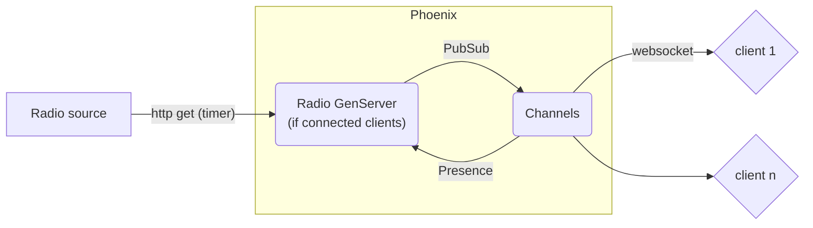

```mermaid
graph LR
A["Radio source"] -- "http get (timer)" --> B

subgraph Phoenix
B("Radio GenServer<br/>(if connected clients)")
B -- "PubSub" --> D(Channels)
D -- Presence --> B
end
D-- websocket --> E{client 1}
D --> F{client n}
```
